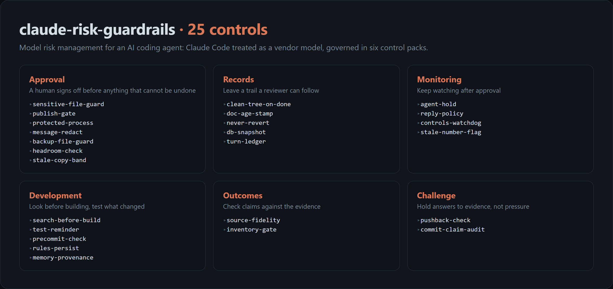

# claude-risk-guardrails

[](https://github.com/scaso01/claude-risk-guardrails/actions/workflows/ci.yml)
[](LICENSE)

**Model risk management (MRM) guardrails for Claude Code: block, verify, record.**

Banks don't trust a vendor model because the vendor says it works. They put controls
around it: effective challenge, outcomes analysis, ongoing monitoring, documentation,
and a human who signs off before anything consequential happens. This repo applies the
same discipline to an AI coding agent.

It ships 25 guardrails in six packs. Each one is a Claude Code
[mod](https://code.claude.com/docs/en/plugins/mods/overview) that runs inside the session.
It checks the agent's claims against evidence, keeps a human in the loop for irreversible
actions, and leaves a record a reviewer can follow.



## Why treat Claude as a vendor model

The current U.S. interagency model risk guidance, SR 26-2 (Federal Reserve, OCC and FDIC,
April 17, 2026), says of third-party models:

> "sound practice involves conducting ongoing monitoring and outcome analysis to assess
> whether vendor models are accurate, remain fit for purpose, and continue to be reliable."

An AI coding agent is a third-party model whose output you act on. It claims a fix
works, cites a line of code, reports that tests pass, or pushes a commit. Every guardrail
here makes one of those claims checkable before you rely on it.

### Scope, stated honestly

SR 26-2 does **not** cover generative or agentic AI. Its footnote 3 reads:

> "Generative AI and agentic AI models are novel and rapidly evolving. As such, they are
> not within the scope of this guidance. Nonetheless, a banking organization's risk
> management and governance practices should guide the determination of appropriate
> governance and controls for any tools, processes, or systems not covered in this document."

So nothing here claims SR 26-2 compliance. The guardrails **apply SR 26-2's principles by
analogy**, as footnote 3 invites. They are also mapped to the framework that does cover
generative AI: the NIST AI Risk Management Framework (AI RMF 1.0) and its Generative AI
Profile (NIST AI 600-1, July 2024). NIST says AI RMF 1.0 is being revised; the mappings in
[docs/CONTROLS.md](docs/CONTROLS.md) will follow the revision. Every mapping is the
author's judgment, not an official crosswalk.

## See it work

Every screenshot in this repo comes from a real, unscripted Claude Code session. Each one
had only these packs loaded and a prompt written to trip one guardrail. Nothing is mocked:
the text is the session's own, shortened to fit.

A repo can't be made public without a person's sign-off:


A reply can't add figures the pasted document never stated:


"Done" can't be said while the session's edits sit uncommitted:


All 25, each with its screenshot, are in [docs/CONTROLS.md](docs/CONTROLS.md).

## The guardrails

### Effective challenge: someone objective questions the output

| Guardrail | What it stops | SR 26-2 (by analogy) | NIST AI RMF |
|---|---|---|---|
| `pushback-check` | The agent dropping a correct answer just because you pushed back. It must re-check the source and either hold its position or name the new fact that changed it. | III Effective Challenge | Measure |
| `commit-claim-audit` | A subagent saying "committed the fix to X" when the commit touched Y. The real `git show --stat` is placed next to the claim. | III Effective Challenge, V Outcomes Analysis | Measure |

### Outcomes analysis: compare what was claimed with what happened

| Guardrail | What it stops | SR 26-2 (by analogy) | NIST AI RMF |
|---|---|---|---|
| `source-fidelity` | Figures in a reply that aren't in the document you pasted, such as a salary, a date or a percentage the source never stated. | V Outcomes Analysis | Measure |
| `inventory-gate` | "I reviewed everything" with no count. A full-coverage claim must say how many items it covered out of how many. | VI Model Inventory | Map |

### Ongoing monitoring: keep watching after approval

| Guardrail | What it stops | SR 26-2 (by analogy) | NIST AI RMF |
|---|---|---|---|
| `agent-hold` | Delegated work arriving piecemeal, so you act on one report before the others land. Background agents' reports are held until the last one finishes, then delivered together. | VI Governance & Controls | Manage |
| `reply-policy` | Replies that break your written response policy. Each final reply is checked against the policy file and rewritten by a second model when it breaks the rules. Violations are logged for review. Off by default. | V Ongoing Monitoring | Measure, Manage |
| `controls-watchdog` | A guardrail that silently stops loading. `/guardrails-status` shows when each pack last loaded, and an outside script warns at session start when a pack has gone missing. | VI Roles & Responsibilities (the internal-audit role) | Govern |
| `stale-number-flag` | Counts and figures saved to notes with no date, which go stale without anyone noticing. | V Ongoing Monitoring (data relevance) | Measure |

### Development and use: build it right, use it as intended

| Guardrail | What it stops | SR 26-2 (by analogy) | NIST AI RMF |
|---|---|---|---|
| `search-before-build` | Large new code written before any search for an existing solution. | IV Model Development | Map |
| `test-reminder` | Code edited and never tested. It names the test that covers the file, once per file. | IV Development (testing) | Measure |
| `precommit-check` | Commits that fail the checks the repo lists in `.claude/precommit`, and commits that skip the repo's hooks. | IV Development (testing) | Measure |
| `rules-persist` | Operating rules lost when the context compacts, the session resumes, the model switches, or a subagent starts with none of them. | IV Model Use | Govern |
| `memory-provenance` | Facts saved to long-term memory with no source or date. | IV Development (data quality) | Map |

### Governance and controls: a human signs off on what can't be undone

| Guardrail | What it stops | SR 26-2 (by analogy) | NIST AI RMF |
|---|---|---|---|
| `publish-gate` | A repo made public, or a push to a public repo, without a person's sign-off. | VI Roles & Responsibilities | Govern |
| `protected-process` | Killing or restarting named critical processes outside their approved route. | VI Roles & Responsibilities | Govern |
| `sensitive-file-guard` | Edits to credentials, keys, `.env` files, `.git/` internals and the agent's own settings, by an edit tool or a shell command. | VI Governance & Controls | Manage |
| `message-redact` | Secrets leaving the session in messages to other agents or sessions. | VI Governance & Controls | Manage |
| `backup-file-guard` | Edits landing in `.bak` or `.orig` copies instead of the live file. | VI Governance & Controls | Manage |
| `headroom-check` | Builds and installs started on a disk that is nearly full. | VI Governance & Controls | Manage |
| `stale-copy-band` | Work done in an old copy of a project instead of the live one. | VI Model Inventory | Map |

### Documentation: leave a trail a reviewer can follow

| Guardrail | What it stops | SR 26-2 (by analogy) | NIST AI RMF |
|---|---|---|---|
| `clean-tree-on-done` | "Done" said while files changed this session are still uncommitted, including files changed by shell commands. | VI Documentation | Manage |
| `doc-age-stamp` | Handoff and status docs read as current when the code has moved on. It shows how old the doc is and how many commits have landed since. | VI Documentation | Map |
| `never-revert` | An edit that undoes a design choice the project wrote down after a past incident. | V Conceptual Soundness | Govern |
| `db-snapshot` | A write to a SQLite database with no backup taken first. | VI Documentation (continuity) | Manage |
| `turn-ledger` | Work with no record. One line per turn records what was asked, what ran and what changed. | VI Documentation | Govern |

## Install

Each pack installs on its own. At a Claude Code prompt:

```text
/plugin install guardrails-approval --marketplace scaso01/claude-risk-guardrails
```

Answer `y` to add the marketplace, then pick a scope. The six packs are
`guardrails-approval`, `guardrails-records`, `guardrails-monitoring`,
`guardrails-development`, `guardrails-outcomes` and `guardrails-challenge`.
Tested on Claude Code 2.1.295.

To run a pack from a clone instead, list its folder in `CLAUDE_CODE_PLUGIN_DIRS` or pass
`claude --plugin-dir packs/<pack>`.

## Configure

Every guardrail has an on/off switch, and most have a setting or two. They appear in the
`/config` menu, or go in `settings.json` under `pluginConfigs`, keyed by pack name:

```json
{
  "pluginConfigs": {
    "guardrails-approval": {
      "protectedProcesses": "postgres => systemctl restart postgresql; nginx",
      "minFreeGB": 20
    },
    "guardrails-development": {
      "rulesFile": "~/.claude/core-rules.md",
      "searchWarnOnly": true
    }
  }
}
```

Each pack's options, with their defaults, are listed in its `.claude-plugin/plugin.json` and
in [docs/CONTROLS.md](docs/CONTROLS.md).

Some guardrails read a small file you keep in the repo:

| File | Read by | What goes in it |
|---|---|---|
| `.claude/precommit` | `precommit-check` | One check command per line, such as `ruff check .` |
| `.claude/never-revert.txt` | `never-revert` | One rule per line: `exact text => why it stays` |
| `.claude/stale-copy.txt` | `stale-copy-band` | Put it in the OLD copy. First line: the live copy's path. Then why. |

## How sign-off works

A guardrail that holds an irreversible action refuses it and shows a one-time code, such
as `G-4821`. The action runs once after **you** type `approve G-4821` at the prompt.

The model can't approve its own action. Only a prompt Claude Code marks as typed by the
person, at the terminal or through Remote Control, counts. An approval lasts 15 minutes
by default (`approvalMinutes`) and covers that one action.

## Evidence

Two kinds of evidence back these guardrails.

- **Which guardrails to build.** [`evidence/replay.py`](evidence/replay.py) replays past
  Claude Code transcripts and counts how often each planned guardrail would have fired.
  That ranked the list, and its false-alarm samples tightened the patterns in
  [`evidence/tight.py`](evidence/tight.py), which carries its own self-test.
- **That each one works.** [`docs/demo/run_demos.py`](docs/demo/run_demos.py) starts a real
  headless Claude Code session per guardrail, in a throwaway folder with only these packs
  loaded, and records whether the guardrail fired. [`docs/demo/render.py`](docs/demo/render.py)
  turns those runs into the screenshots. The live runs found six real bypasses that unit
  tests missed. All six are fixed:
  1. A `.env` file appended to through a PowerShell .NET call.
  2. A file changed by a shell `>>` that "done" didn't count.
  3. A repo made public through a wrapper command (`rtk gh repo edit ...`).
  4. A failing check reported with the wrong exit code.
  5. A backup copy edited with `sed -i` instead of the Edit tool.
  6. An old project copy edited the same way.

Every pack also has unit tests, run by `claude plugin test` in CI on Linux and Windows.

## Design principles

- **Evidence over claims.** A guardrail checks what the agent did, not what it says it did.
- **A human signs off on irreversible actions.** Publishing, killing protected processes
  and editing secrets wait for an explicit go.
- **Fail loudly, never silently.** A guardrail that holds an action refuses when it can't
  run its check, rather than letting the action through.
- **Watch the watchers.** `controls-watchdog` notices when a pack stops loading, from
  outside the packs themselves.
- **Reuse before building.** Where a good public mod already does the job, this repo points
  to it instead of copying it.

## Works alongside

These public mods already do part of the job well and complement this set:
[eol-guard](https://github.com/Tihi321/claude-mods/blob/master/plugins/eol-guard) (line endings),
[spotcheck](https://github.com/ivanvyd/ground-rules/blob/main/plugins/spotcheck) (citation checks),
[groundtruth](https://github.com/vnmoorthy/groundtruth) and
[anti-cheat](https://github.com/pourya7/claude-code-mods/blob/main/anti-cheat) (completion claims).

## Not legal or compliance advice

This is an engineering project that borrows the structure of model risk management.
It is not affiliated with Anthropic, the Federal Reserve, the OCC, the FDIC or NIST, and
using it doesn't make any organization compliant with anything.

## License

[MIT](LICENSE)
